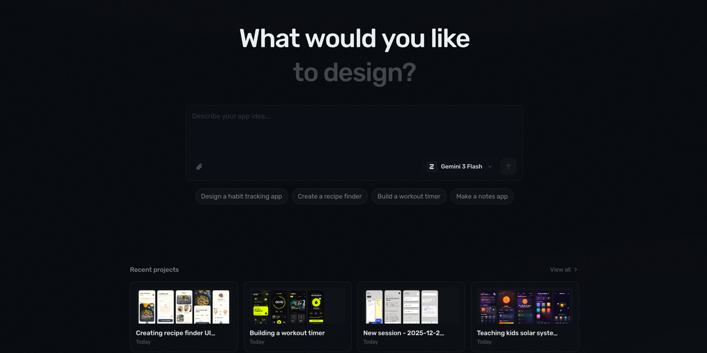

# Dilag

> AI-powered design studio for mobile and web. Describe your app in natural language and watch AI design production-ready screens in real-time.

[](LICENSE)
[](https://tauri.app)
[](https://react.dev)
[](https://www.typescriptlang.org)



## Overview

Dilag is a desktop application that transforms ideas into polished mobile and web designs. Simply describe what you want—"a habit tracking app," "a recipe finder with search"—and AI generates production-ready screens. Iterate in real-time by chatting with the AI to refine your designs.

**Perfect for:**
- Rapid prototyping and UI exploration
- Turning ideas into polished screens without design tools
- Iterating on designs through natural conversation
- Mobile, tablet, and web screen generation

## Features

- **Natural Language Design** – Describe your app and get polished UI screens
- **Live Preview** – See designs rendered in real-time on an infinite canvas
- **Iterative Refinement** – Chat with AI to improve and expand your screens
- **Multi-Model Support** – Choose from Claude, GPT, Gemini, and more
- **Multi-Platform** – Design for iOS, Android, macOS, Windows, Web, and Tablet
- **Project History** – Save, organize, and revisit all your designs
- **Production-Ready Output** – Generated screens use Tailwind CSS and modern HTML

## Quick Start

### Prerequisites

- [Bun](https://bun.sh) 1.2+
- [Rust](https://rustup.rs) 1.70+

### Installation

```bash
# Clone the repository
git clone https://github.com/yourusername/dilag.git
cd dilag

# Install dependencies
bun install

# Run the desktop app
bun run dev:desktop
```

### Usage

1. Launch the app
2. Describe your app in the prompt box
3. Select your AI model and target platform
4. Watch your screens get designed in real-time
5. Iterate by chatting with the AI

## Project Structure

This is a monorepo containing:

```
dilag/
├── apps/
│   ├── desktop/          # Tauri 2 desktop app (React + Rust)
│   └── web/              # Next.js marketing site + licensing API
├── packages/
│   └── shared/           # Shared TypeScript types
├── turbo.json            # Turborepo config
└── package.json          # Bun workspaces
```

| Package | Description |
|---------|-------------|
| [`apps/desktop`](apps/desktop/README.md) | Main desktop application |
| [`apps/web`](apps/web/README.md) | Website and trial/licensing API |
| [`packages/shared`](packages/shared/README.md) | Shared types between apps |

## Development

```bash
# Install dependencies
bun install

# Run desktop app (Tauri + Vite)
bun run dev:desktop

# Run web app (Next.js)
bun run dev:web

# Run all apps
bun run dev

# Build all
bun run build

# Run tests
bun run test
```

### Desktop App Commands

```bash
cd apps/desktop
bun run tauri dev      # Full Tauri development
bun run tauri build    # Production build
bun test               # Run Vitest tests
```

## Tech Stack

**Desktop App:**
- Tauri 2 (Rust backend)
- React 19 + TypeScript
- Vite + Tailwind CSS
- shadcn/ui components
- Zustand + React Query
- TanStack Router

**Website:**
- Next.js 16 (App Router)
- better-auth + Polar.sh
- Drizzle ORM + PostgreSQL

## Documentation

- [Desktop Architecture](apps/desktop/docs/architecture.md) – App startup, data flow, storage
- [Platform Guide](apps/desktop/docs/platform.md) – UI screens, components, tool registry
- [Changelog](CHANGELOG.md) – Version history

## Contributing

Contributions are welcome! Please feel free to submit a Pull Request.

1. Fork the repository
2. Create your feature branch (`git checkout -b feature/amazing-feature`)
3. Commit your changes (`git commit -m 'Add amazing feature'`)
4. Push to the branch (`git push origin feature/amazing-feature`)
5. Open a Pull Request

## Roadmap

- [ ] Export to deployable packages
- [ ] GitHub integration
- [ ] Project template library
- [ ] Team collaboration
- [ ] Database integration
- [ ] API endpoint generation

## License

[MIT](LICENSE)

## Acknowledgments

- [Tauri](https://tauri.app) – Desktop runtime
- [OpenCode](https://opencode.ai) – AI SDK
- [shadcn/ui](https://ui.shadcn.com) – Component library
- [Polar.sh](https://polar.sh) – Licensing and payments
