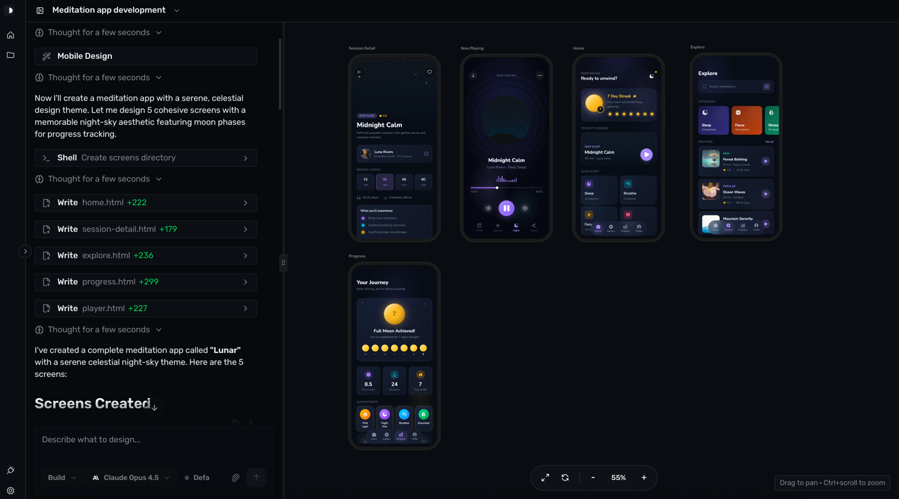

# Dilag

> AI-powered design studio for mobile and web. Describe your app in natural language and generate production-ready screens in real time.

[](LICENSE)
[](https://tauri.app)
[](https://react.dev)
[](https://www.typescriptlang.org)



## Overview

Dilag is a desktop application that turns ideas into polished mobile and web designs. Describe what you want and iterate through chat with AI.

## Project Structure

```
dilag/
├── apps/
│   ├── desktop/          # Tauri 2 desktop app (React + Rust)
│   └── web/              # Next.js marketing site
├── packages/
│   └── ui/               # Shared UI components
├── turbo.json            # Turborepo config
└── package.json          # Bun workspaces
```

| Package | Description |
|---------|-------------|
| [`apps/desktop`](apps/desktop/README.md) | Main desktop application |
| [`apps/web`](apps/web/README.md) | Public marketing website |
| [`packages/ui`](packages/ui/README.md) | Shared UI primitives/components |

## Quick Start

### Prerequisites

- [Bun](https://bun.sh) 1.2+
- [Rust](https://rustup.rs) 1.70+

### Install

```bash
git clone https://github.com/noelrohi/dilag.git
cd dilag
bun install
```

### Run

```bash
# Desktop app
bun run dev:desktop

# Web app
bun run dev:web

# All apps
bun run dev
```

## Build & Test

```bash
bun run build
bun run test
bun run lint
```

## Desktop Tech Stack

- Tauri 2 (Rust backend)
- React 19 + TypeScript
- Vite + Tailwind CSS
- shadcn/ui components
- Zustand + React Query
- TanStack Router

## Web Tech Stack

- Next.js 16 (App Router)
- React 19
- Tailwind CSS 4

## Documentation

- [Desktop Architecture](docs/architecture.md)
- [Platform Guide](docs/platform.md)
- [Changelog](CHANGELOG.md)

## Contributing

Contributions are welcome via pull request.

## License

[MIT](LICENSE)

## Acknowledgments

- [Tauri](https://tauri.app) – Desktop runtime
- [OpenCode](https://opencode.ai) – AI SDK
- [shadcn/ui](https://ui.shadcn.com) – Component library
