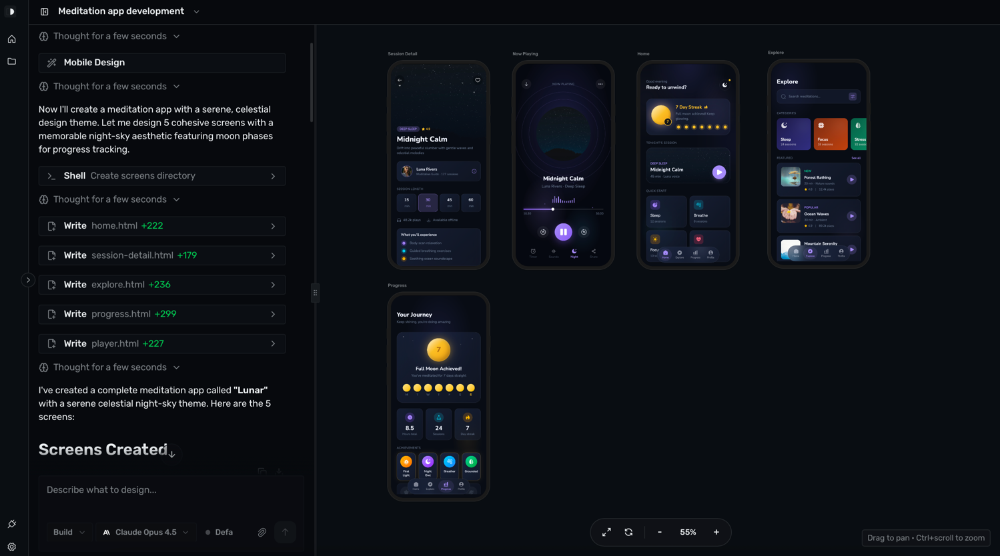

# Dilag

> AI-powered design studio for mobile and web. Describe your app in natural language and watch AI design production-ready screens in real-time.

[](https://opensource.org/licenses/MIT)
[](https://tauri.app)
[](https://react.dev)
[](https://www.typescriptlang.org)



## Overview

Dilag is a desktop application that transforms ideas into polished mobile and web designs. Simply describe what you want to design—"a habit tracking app," "a recipe finder with search"—and AI generates production-ready screens as HTML files. Iterate in real-time by chatting with the AI to refine and improve your designs.

Perfect for:
- 🚀 Rapid prototyping and UI design
- 💡 Turning ideas into polished screens without design tools
- 🔄 Iterating on designs through conversation
- 📱 Mobile and web screen generation
- ⚡ Accelerating the idea-to-design workflow

## Features

✨ **Natural Language Design** – Describe your app and get polished UI screens

🖥️ **Live Preview** – See your designs rendered in real-time on an infinite canvas

💬 **Iterative Design** – Chat with AI to refine and improve your screens

🤖 **Multi-Model Support** – Choose from Claude, GPT, Gemini, and more

📚 **Project History** – Save, organize, and revisit all your designs

🎨 **Production-Ready Output** – Generated screens use Tailwind CSS and modern HTML

## Quick Start

### Prerequisites

- **Node.js** 18+ and **Bun**
- **Rust** 1.70+ (for Tauri)
- **VS Code** (recommended)

### Installation

```bash
# Clone the repository
git clone https://github.com/noelrohi/dilag.git
cd dilag

# Install dependencies
bun install

# Start the development server
bun run tauri dev
```

### Development Commands

```bash
# Vite dev server (frontend only)
bun run dev

# Full Tauri app (frontend + Rust backend)
bun run tauri dev

# Type checking
tsc --noEmit

# Production build
bun run tauri build
```

## Architecture

### Frontend Stack
- **React 19** – UI framework
- **TypeScript** – Type safety
- **Vite** – Build tool
- **Tailwind CSS** – Styling
- **shadcn/ui** – Component library (Radix UI based)
- **Zustand** – Client state management
- **React Query** – Server state management
- **TanStack Router** – File-based routing

### Backend Stack
- **Tauri** – Desktop runtime (Rust)
- **OpenCode SDK** – AI integration with SSE streaming

### Data Flow
```
User Prompt
    ↓
Session Creation
    ↓
AI Processing (OpenCode)
    ↓
Screen Generation (HTML + Tailwind)
    ↓
Live Preview on Canvas
    ↓
Iterative Refinement via Chat
```

## Project Structure

```
dilag/
├── src/                          # React frontend
│   ├── components/
│   │   ├── ai-elements/         # Chat and AI UI components
│   │   ├── blocks/              # Page layouts and sections
│   │   └── ui/                  # shadcn/ui primitives
│   ├── context/
│   │   ├── global-events.tsx    # SSE event provider
│   │   └── session-store.tsx    # Zustand store
│   ├── hooks/
│   │   ├── use-designs.ts       # Design file polling
│   │   ├── use-models.ts        # Model selection
│   │   └── use-sessions.ts      # Session management
│   ├── routes/
│   │   ├── index.lazy.tsx       # Home screen
│   │   └── studio.$sessionId.lazy.tsx # Design studio
│   └── lib/
│       ├── tool-registry.tsx    # Tool display configs
│       └── utils.ts             # Utilities
├── src-tauri/                    # Rust backend (Tauri)
│   ├── src/
│   │   ├── lib.rs              # Commands
│   │   └── main.rs             # Entry point
│   └── tauri.conf.json          # Tauri config
├── docs/
│   ├── architecture.md          # Technical architecture
│   └── platform.md              # UI and platform docs
└── package.json
```

## Usage

### Creating Your First Design

1. **Launch the app** and land on the home screen
2. **Describe your app** in the prompt box:
   ```
   A habit tracking app with a dashboard showing daily streaks,
   a habit list, and settings page
   ```
3. **Select your AI model** (Claude, GPT, etc.)
4. **Hit submit** and watch your screens get designed in real-time
5. **Iterate** by chatting with the AI to refine your designs

### Working with Designs

- **Live Preview** – Your screens render on an infinite canvas
- **Viewport Modes** – Switch between desktop, tablet, and mobile views
- **Iterate** – Type in the chat pane to refine designs or add screens
- **Auto-Save** – All designs are automatically saved locally

## Data Storage

Dilag stores everything locally on your machine:

```
~/.dilag/
├── sessions/                    # Design project directories
│   └── {project-uuid}/
│       └── screens/            # Generated HTML screens
├── sessions.json               # Project metadata
└── opencode/
    └── opencode.json          # AI agent config
```

Sensitive data (API keys, tokens) is stored in `~/.local/share/opencode/` and isolated from your projects.

## Development

### Code Style Guide

```typescript
// Imports: Use @/* alias for src/*
import { Button } from "@/components/ui/button"
import { cn } from "@/lib/utils"

// Components: Function components with TypeScript
export function MyComponent({ prop }: { prop: string }) {
  return <div className={cn("base", "class")} />
}

// Naming conventions
// - Components: PascalCase (MyComponent.tsx)
// - Functions: camelCase (myFunction)
// - Files: kebab-case (my-component.tsx)
// - CSS: Tailwind with cn() utility
```

### Type Checking

```bash
tsc --noEmit
```

### Adding New Features

1. Check `docs/architecture.md` for current data flow
2. Update Zustand store if adding new state
3. Create components in appropriate `src/components/*` folder
4. Use `@/*` imports and TypeScript types
5. Test type checking: `tsc --noEmit`

## Documentation

- **[Platform Docs](./docs/platform.md)** – UI screens, components, user flows, tool registry
- **[Architecture Docs](./docs/architecture.md)** – App startup, storage, SSE events, session lifecycle
- **[AGENTS.md](./AGENTS.md)** – Development setup and conventions

## Contributing

Contributions are welcome! Please feel free to submit a Pull Request.

1. Fork the repository
2. Create your feature branch (`git checkout -b feature/amazing-feature`)
3. Commit your changes (`git commit -m 'Add amazing feature'`)
4. Push to the branch (`git push origin feature/amazing-feature`)
5. Open a Pull Request

## Troubleshooting

### Server won't start

```bash
# Ensure no other instance is running
lsof -i :4096

# Clear cached data
rm -rf ~/.dilag/opencode
bun run tauri dev
```

### Preview not loading

1. Check that Bun is installed (`bun --version`)
2. Check `~/.dilag/sessions/{id}/` for project files
3. Check browser console for errors (DevTools in Tauri dev mode)

## License

MIT © 2024-2026 Dilag

## Acknowledgments

- [Tauri](https://tauri.app) – Desktop runtime
- [OpenCode](https://opencode.ai) – AI integration
- [shadcn/ui](https://ui.shadcn.com) – Component library
- [React](https://react.dev) – UI framework

---

**Made with ❤️ for designers and developers**
